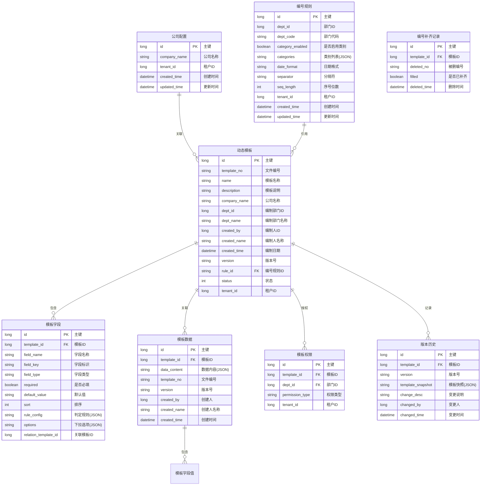

# PRD：动态表单系统 + 数据权限配置

## 元信息

| 项目 | 内容 |
|------|------|
| 产品名称 | 动态表单系统 |
| 产品类型 | B2B 企业级 SaaS 功能模块 |
| PRD 类型 | 新功能（有 UI） |
| 基于框架 | wemirr-platform v4-dev |
| 模块范围 | 动态模板管理、字段配置、数据填报、数据权限配置、公司基础信息、版本管理 |
| 创建时间 | 2025-01-28 |

---

## 1. 项目架构与开发方式

### 1.1 框架使用说明

本项目基于 **wemirr-platform v4-dev** 开源框架进行开发，采用"在开源框架基础上添加新功能"的开发模式。

#### 1.1.1 框架与项目的关系

```
saas/
├── wemirr-platform-4-dev/              ← 开源框架（参考用，不改动）
│   ├── wemirr-platform-iam/            ← 认证授权服务
│   ├── wemirr-platform-gateway/        ← 网关服务
│   ├── wemirr-platform-framework/      ← 核心框架模块
│   └── ... 其他模块
└── dynamic-module/                     ← 新模块（你的代码）
    ├── pom.xml                         ← Maven 依赖配置
    └── src/main/java/com/wemirr/platform/dynamic/
        ├── DynamicApplication.java
        ├── controller/
        ├── service/
        ├── repository/
        └── domain/
```

#### 1.1.2 框架已提供的功能（直接使用，无需重复开发）

| 功能模块 | 框架状态 | 说明 |
|---------|---------|------|
| 用户管理 | ✅ 框架提供 | 用户CRUD、认证、授权 |
| 角色权限 | ✅ 框架提供 | RBAC 权限体系 |
| 部门管理 | ✅ 框架提供 | 组织架构管理 |
| 字典管理 | ✅ 框架提供 | 通用字典数据 |
| 登录认证 | ✅ 框架提供 | Sa-Token 认证 |
| 多租户隔离 | ✅ 框架提供 | tenant_id 自动隔离 |
| 分页查询 | ✅ 框架提供 | PageRequest + SuperMapper |
| 操作日志 | ✅ 框架提供 | @AccessLog 注解 |
| 数据库访问 | ✅ 框架提供 | Mybatis-Plus 基础CRUD |
| 数据权限 | ✅ 框架提供 | @DataScope 注解 |
| 雪花算法ID | ✅ 框架提供 | 自动生成主键 |

#### 1.1.3 开发者需要编写的功能

| 功能模块 | 开发状态 | 说明 |
|---------|---------|------|
| 动态模板管理 | 🚧 开发中 | 模板 CRUD |
| 字段配置 | 🚧 待开发 | 字段类型、判定规则 |
| 数据填报 | 🚧 待开发 | 动态表单填写 |
| 数据权限配置 | 🚧 待开发 | 部门级权限控制 |
| 公司基础信息 | 🚧 待开发 | 公司名称配置 |
| 编号规则 | 🚧 待开发 | 编号自动生成 |

#### 1.1.4 开发规范（遵循框架约定）

**必须遵循的规范**：
- 实体类继承 `SuperEntity<Long>`
- Service 接口继承 `SuperService<T>`
- Service 实现继承 `SuperServiceImpl<Mapper, T>`
- Mapper 继承 `SuperMapper<T>`
- 分页请求继承 `PageRequest`
- 使用 `@SaCheckPermission` 控制权限
- 使用 `@AccessLog` 记录操作日志
- 使用 `Wraps.<T>lbQ()` 构建查询条件
- 使用 `AuthenticationContext` 获取当前用户信息
- 表名使用 `t_` 前缀
- 所有表包含 `deleted`、`tenant_id` 公共字段

**包名约定**：`com.wemirr.platform.{模块名}`

#### 1.1.5 代码复用示例

```java
// Service 实现示例（复用框架能力）
@Service
@RequiredArgsConstructor
public class TemplateServiceImpl extends SuperServiceImpl<TemplateMapper, DynamicTemplate>
        implements TemplateService {

    private final AuthenticationContext context;

    @Override
    public void create(TemplateSaveReq req) {
        // 复用框架的 count() 方法查询
        final long count = super.count(Wraps.<DynamicTemplate>lbQ()
                .eq(DynamicTemplate::getName, req.getName()));

        // 复用框架的 AuthenticationContext 获取当前用户
        bean.setCreatedBy(context.userId());
        bean.setCreatedName(context.username());
        bean.setTenantId(context.tenantId());
    }
}
```

#### 1.1.6 环境配置要求

本项目采用**本地开发 + Docker 中间件**的混合方案。

| 软件 | 版本 | 安装方式 | 用途 |
|------|------|---------|------|
| JDK | 21 | 本地安装 | 运行 Spring Boot 3.5.7 |
| Maven | 3.9+ | 本地安装 | 项目构建、依赖管理 |
| Docker | 20+ | 本地安装 | 运行 MySQL、Redis、Nacos、RabbitMQ |
| MySQL | 8.0.40 | Docker 容器 | 主数据库 |
| Redis | 7.4-alpine | Docker 容器 | 缓存、Session |
| Nacos | 2.4.3 | Docker 容器 | 服务发现、配置中心 |
| RabbitMQ | 4.0 | Docker 容器 | 消息队列（工作流） |

**Docker Compose 配置（~/saas-dev/docker-compose.yml）：**

```yaml
services:
  mysql:
    image: mysql:8.0.40
    ports:
      - "3306:3306"
    environment:
      MYSQL_ROOT_PASSWORD: 123456
    volumes:
      - mysql_data:/var/lib/mysql

  redis:
    image: redis:7.4-alpine
    ports:
      - "6379:6379"
    command: redis-server --appendonly yes --maxmemory 256mb

  nacos:
    image: nacos/nacos-server:v2.4.3
    ports:
      - "8848:8848"
    environment:
      MODE: standalone

  rabbitmq:
    image: rabbitmq:4.0-management
    ports:
      - "5672:5672"
      - "15672:15672"
    environment:
      RABBITMQ_DEFAULT_USER: admin
      RABBITMQ_DEFAULT_PASS: admin
```

**启动命令：**

```bash
# 启动全部中间件
docker-compose up -d

# 检查状态
docker ps

# 停止全部
docker-compose down
```

**macOS 环境安装（已验证）：**

```bash
# JDK 21
brew install --cask temurin@21
export JAVA_HOME=$(/usr/libexec/java_home -v 21)
export PATH=$JAVA_HOME/bin:$PATH

# Maven（SDKMAN）
curl -s "https://get.sdkman.io" | bash
source "~/.sdkman/bin/sdkman-init.sh"
sdk install maven

# Docker Desktop
brew install --cask docker
```

**启动顺序：**

```
1. Docker Desktop 启动
2. docker-compose up -d（启动 MySQL、Redis、Nacos、RabbitMQ）
3. IDE 打开项目，运行 IamApplication
```

---

## 2. 业务背景

### 2.1 业务现状

食品生产企业各部门的业务表单存在以下问题：

- **表单不统一**：各部门使用各自的 Excel 或纸质表格，格式各异
- **表头信息重复填写**：公司名称、编制人、审核人等固定信息每次都要手动填写
- **版本管理混乱**：文档修订后版本号混乱，无法追溯历史版本
- **编号规则不清晰**：文件编号各管各的，缺乏统一规范
- **新增字段麻烦**：业务变化需要新增字段时，需要找程序员改代码
- **权限不清晰**：谁可以创建数据、谁只能使用数据，缺乏统一管理
- **数据孤岛**：各部门数据分散，缺乏关联和共享机制

### 1.2 业务目标

本模块旨在实现：

- 通用动态表单系统，支持各部门创建自己的业务表单
- 公司基础信息一次配置，全局自动引用
- 模板表头自动填充公司名称、编制部门、编制人等信息
- 版本号自动管理，支持版本追溯
- 文件编号规则可配置，按规则自动生成编号
- 字段可配置，随时调整无需修改代码
- 数据权限可配置，控制谁可以创建、谁可以使用
- 统一数据存储，支持查询、统计、导出

### 1.3 用户群体

| 角色 | 描述 | 主要使用场景 |
|------|------|-------------|
| 系统管理员 | 负责系统配置 | 配置公司基础信息、编号规则、管理所有模板 |
| 模板管理员 | 各部门负责人 | 创建/管理本部门模板，配置字段和权限 |
| 数据填报人员 | 普通员工 | 填写表单数据 |
| 数据查看人员 | 各部门人员 | 查询、导出已填写的数据 |

---

## 2. 业务现状与变更

### 2.1 现有流程（Excel/纸质表单）

```
各部门自行设计表格格式
        ↓
    表头手动填写（公司名称、编制人等）
        ↓
    人工填写内容
        ↓
    手动编版本号、文件编号
        ↓
    各自保存（纸质/Excel）
```

### 2.2 变更内容

| 变更项 | 现状（变更前） | 目标（变更后） | 影响范围 |
|--------|---------------|---------------|---------|
| 公司信息填写 | 每次手动填写 | 一次配置，全局自动引用 | 所有部门 |
| 表头信息 | 每次手动填写 | 自动填充 | 所有部门 |
| 版本号管理 | 手动编写 | 自动生成 | 所有模板 |
| 文件编号 | 手动编写 | 按规则自动生成 | 所有模板 |
| 表单创建 | 固定格式，修改需改代码 | 动态配置，灵活调整 | 所有部门 |
| 字段管理 | 写死在代码里 | 用户可配置 | 所有部门 |
| 权限控制 | 无统一管理 | 可配置数据权限 | 所有部门 |

### 2.3 影响范围

- **受影响部门**：所有部门
- **需复用系统模块**：wemirr-platform-iam（用户、角色、权限、组织架构）
- **新增数据库表**：5 张（新增公司配置表）

---

## 3. 用户故事和使用场景

### 3.1 关键用户故事

| 编号 | 用户故事 | 角色 | 优先级 |
|------|---------|------|--------|
| US-01 | 作为系统管理员，我希望配置公司名称，后续表单自动引用 | 系统管理员 | P0 |
| US-02 | 作为系统管理员，我希望配置文件编号规则，系统自动生成编号 | 系统管理员 | P0 |
| US-03 | 作为模板管理员，我希望创建表单模板，添加所需字段 | 模板管理员 | P0 |
| US-04 | 作为模板管理员，我希望配置字段类型和是否必填 | 模板管理员 | P0 |
| US-05 | 作为模板管理员，我希望配置数据权限，指定哪些部门可以使用 | 模板管理员 | P0 |
| US-06 | 作为模板管理员，我希望每次编辑模板时版本号自动+1 | 模板管理员 | P0 |
| US-07 | 作为数据填报人员，我希望根据模板填写数据 | 数据填报人员 | P0 |
| US-08 | 作为数据填报人员，我希望只能选择已有数据，不能新建（特定场景） | 数据填报人员 | P0 |
| US-09 | 作为数据查看人员，我希望查询和导出表单数据 | 数据查看人员 | P1 |

### 3.2 使用场景

#### 场景 1：系统管理员配置公司基础信息

```
场景描述：首次使用系统时，配置公司名称

前置条件：
- 用户已登录系统
- 用户具有"系统管理"权限

主流程：
1. 进入"公司基础信息"配置页面
2. 填写公司名称（例：XX食品有限公司）
3. 保存配置

后置条件：
- 公司名称保存成功
- 所有新建模板自动引用公司名称
- 所有填报数据自动引用公司名称
```

#### 场景 2：系统管理员配置文件编号规则

```
场景描述：配置文件编号的生成规则

前置条件：
- 用户已登录系统
- 用户具有"系统管理"权限

主流程：
1. 进入"编号规则配置"页面
2. 选择部门（例：加工部 J）
3. 勾选"启用类别"，配置类别列表（一级文件、二级文件、三级文件）
4. 选择日期格式（YYYYMMDD）
5. 选择分隔符（-）
6. 选择序号位数（3位）
7. 预览示例：J-SOP-20250128-001
8. 保存配置

后置条件：
- 编号规则保存成功
- 新建模板时自动按规则生成编号
```

#### 场景 3：研发部创建产品模板

```
场景描述：研发部创建"产品信息"模板，配置字段和权限

前置条件：
- 用户已登录系统
- 用户具有"模板管理"权限
- 用户属于"研发部"

主流程：
1. 进入"动态模板管理"页面
2. 点击"新建模板"
3. 系统自动生成文件编号：J-SOP-20250128-001（按编号规则）
4. 填写模板信息：
   - 模板名称：产品信息
   - 所属部门：研发部
   - 模板说明：用于管理产品基本信息
5. 表头信息自动填充：
   - 公司名称：XX食品有限公司（来自系统配置）
   - 编制部门：研发部（当前用户部门）
   - 编制人：张三（当前用户）
   - 编制日期：2025-01-28（当前日期）
   - 版本号：1.0（初始版本）
6. 添加字段：
   - 字段1：产品名称（文本，必填）
   - 字段2：规格型号（文本，必填）
   - 字段3：保质期（数值，选填）
   - 字段4：产品分类（下拉选择）
7. 配置数据权限：
   - 研发部：创建、使用、查看
   - 检验部：使用、查看（只能选择，不能新建）
   - 生产部：使用、查看
8. 保存并启用模板

后置条件：
- 模板创建成功，版本号为 1.0
- 研发部可以新建产品
- 检验部、生产部只能从已有产品中选择
```

#### 场景 4：模板版本更新

```
场景描述：模板需要修改，版本号自动更新

前置条件：
- 模板已有版本 1.0

主流程：
1. 进入模板编辑页面
2. 修改字段配置（新增一个字段）
3. 保存模板
4. 系统自动更新版本号为 1.1

后置条件：
- 模板版本更新为 1.1
- 历史版本 1.0 数据保留
- 可查看版本历史记录
```

---

## 4. 功能需求描述

### 4.1 功能模块结构

```
动态表单系统
├── 4.1.1 公司基础信息配置
│   ├── 公司名称配置
│   └── 配置查询
├── 4.1.2 编号规则配置
│   ├── 部门选择
│   ├── 类别配置（启用/禁用、添加/编辑/删除/排序）
│   ├── 日期格式配置
│   ├── 分隔符配置
│   ├── 序号位数配置
│   └── 规则预览
├── 4.1.3 模板管理
│   ├── 模板列表（按部门筛选）
│   ├── 新建模板（自动生成编号和版本号）
│   ├── 编辑模板（版本号+1）
│   ├── 启用/停用模板
│   ├── 删除模板（需无数据）
│   └── 版本历史查看
├── 4.1.4 字段配置
│   ├── 添加字段
│   ├── 编辑字段
│   ├── 删除字段
│   ├── 字段排序
│   └── 字段类型配置
├── 4.1.5 数据填报
│   ├── 选择模板
│   ├── 动态表单填写（表头自动填充）
│   ├── 数据关联选择
│   └── 填报记录提交
├── 4.1.6 数据查询
│   ├── 填报记录列表
│   ├── 条件筛选
│   ├── 详情查看
│   └── 数据导出
└── 4.1.7 数据权限配置
    ├── 模板权限列表
    ├── 配置部门权限
    ├── 权限类型设置
    └── 权限继承配置
```

### 4.2 公司基础信息配置

| 功能 | 描述 |
|------|------|
| 公司名称配置 | 配置公司名称，全局使用 |
| 配置查询 | 查看当前配置 |

### 4.3 编号规则配置

#### 4.3.1 编号格式组成

| 组成部分 | 数据来源 | 说明 | 示例 |
|----------|----------|------|------|
| 部门代码 | 组织架构选择 | 用户选择部门，自动取部门代码 | J（加工部） |
| 类别（可选） | 用户自定义 | 可启用/禁用，多个类别可选 | SOP、WI、PI |
| 日期 | 系统自动 | 按选定格式生成当前日期 | 20250128 |
| 序号 | 系统自动+1 | 补齐位数，自动递增 | 001 |

#### 4.3.2 编号生成公式

```
{部门代码}[-类别][-日期]-序号

示例（启用类别）：J-SOP-20250128-001
示例（不启用类别）：J-20250128-001
```

#### 4.3.3 编号规则配置页面

| 字段 | 描述 | 操作 |
|------|------|------|
| 部门 | 从组织架构选择部门 | 下拉选择 |
| 类别启用 | 是否启用类别配置 | 开关（勾选显示类别配置） |
| 类别列表 | 自定义类别名称 | 添加/编辑/删除/拖拽排序 |
| 日期格式 | 日期显示格式 | 下拉选择：YYYYMMDD / YYYYMMDD / 无 |
| 分隔符 | 连接各部分的分隔符 | 下拉选择：- / _ / 无 |
| 序号位数 | 序号补齐位数 | 下拉选择：3位 / 4位 / 5位 |
| 预览 | 预览生成效果 | 自动显示示例 |

#### 4.3.4 类别配置

| 功能 | 描述 |
|------|------|
| 添加类别 | 输入类别名称，添加到列表 |
| 编辑类别 | 修改已添加的类别名称 |
| 删除类别 | 从列表中删除类别 |
| 拖拽排序 | 调整类别显示顺序 |

#### 4.3.5 序号补齐逻辑

| 场景 | 处理方式 |
|------|----------|
| 新建编号 | 从 001 开始递增 |
| 删除记录 | 记录被删编号到待补齐列表 |
| 后续新建 | 检查待补齐列表，取最小编号补齐 |
| 补齐后 | 从待补齐列表移除该编号 |

**示例流程**：
```
已有编号：J-SOP-20250128-001, 002, 003
删除 002 → 记录 002 到待补齐列表
删除 003 → 记录 003 到待补齐列表
新建时 → 取 002 作为新编号
结果：J-SOP-20250128-001, 003（已删）, 002（新建）
```

### 4.4 模板管理

#### 4.4.1 模板列表

| 功能 | 描述 |
|------|------|
| 模板列表 | 显示所有模板，支持按部门筛选 |
| 模板状态 | 显示启用/停用状态 |
| 表头信息 | 显示公司名称、编制部门、版本号 |
| 数据统计 | 显示模板关联的数据条数 |
| 操作 | 编辑、启用/停用、删除、版本历史 |

#### 4.4.2 新建/编辑模板

| 功能 | 描述 |
|------|------|
| 文件编号 | 自动生成（按编号规则），不可编辑 |
| 版本号 | 新建时显示 1.0，编辑后自动+1 |
| 模板名称 | 输入模板名称（必填） |
| 所属部门 | 选择模板归属部门（必填） |
| 模板说明 | 输入模板用途描述 |
| 表头信息 | 自动填充（公司名称、编制部门、编制人、编制日期、版本号） |
| 字段管理 | 添加、编辑、删除字段 |
| 权限配置 | 配置各部门使用权限 |
| 保存 | 保存模板 |
| 启用 | 启用后可供使用 |

#### 4.4.3 版本历史

| 功能 | 描述 |
|------|------|
| 版本列表 | 显示所有历史版本 |
| 版本详情 | 查看特定版本的内容 |
| 版本对比 | 可选，对比不同版本差异 |
| 版本回滚 | 可选，恢复到历史版本 |

### 4.5 字段配置

#### 4.5.1 字段类型支持

| 字段类型 | 说明 | 支持的判定规则 |
|----------|------|---------------|
| 文本 | 短文本输入 | 无 |
| 长文本 | 多行文本输入 | 无 |
| 数值 | 数字输入 | 范围判定 |
| 日期 | 日期选择 | 范围判定 |
| 日期时间 | 日期时间选择 | 范围判定 |
| 下拉选择 | 从预选项中选择 | 枚举判定 |
| 关联选择 | 从其他模板选择数据 | 无 |
| 是/否 | 布尔选择 | 无 |

#### 4.5.2 字段属性

| 属性 | 描述 | 必填 |
|------|------|------|
| 字段名称 | 显示名称（必填） | 是 |
| 字段标识 | 英文标识（必填） | 是 |
| 字段类型 | 选择字段类型（必填） | 是 |
| 是否必填 | 是否为必填项 | 否 |
| 默认值 | 预设默认值 | 否 |
| 字段排序 | 字段显示顺序 | 否 |
| 判定规则 | 合格标准配置（仅数值/日期） | 否 |
| 下拉选项 | 下拉选择的可选值（仅下拉选择） | 否 |
| 关联模板 | 关联其他模板（仅关联选择） | 否 |

### 4.6 数据填报

| 功能 | 描述 |
|------|------|
| 模板选择 | 从已启用模板中选择 |
| 动态表单 | 根据模板字段动态生成表单 |
| 表头显示 | 显示公司名称、编制部门、编制人、编制日期、版本号 |
| 关联选择 | 关联选择字段弹出选择弹窗 |
| 实时校验 | 必填项实时校验 |
| 自动判定 | 根据规则自动计算合格/不合格 |
| 表单提交 | 保存填报记录 |

### 4.7 数据权限配置

#### 4.7.1 权限类型

| 权限类型 | 说明 | 适用场景 |
|----------|------|---------|
| 创建 | 可以新建数据 | 研发部创建产品 |
| 使用 | 可以从列表选择关联数据 | 检验部关联产品 |
| 查看 | 可以查看数据列表和详情 | 所有部门查看 |
| 导出 | 可以导出数据 | 报表统计 |
| 管理 | 完整权限（创建、使用、查看、导出、删除） | 模板管理员 |

#### 4.7.2 权限配置

| 功能 | 描述 |
|------|------|
| 部门权限配置 | 为模板配置各部门的权限 |
| 权限继承 | 子部门继承父部门权限 |
| 权限覆盖 | 子部门可单独配置覆盖继承 |

---

## 5. 业务规则和约束

### 5.1 基础规则

| 规则编号 | 规则描述 |
|---------|----------|
| BR-001 | 公司基础信息配置后，新建模板自动引用公司名称 |
| BR-002 | 编号规则配置后，新模板自动按规则生成文件编号 |
| BR-003 | 新建模板版本号为 1.0 |
| BR-004 | 编辑已发布模板，版本号自动+1（如 1.0 → 1.1） |
| BR-005 | 主版本号升级需手动确认（如 1.9 → 2.0） |
| BR-006 | 模板停用后，不可再新建数据，但历史数据可查询 |
| BR-007 | 模板删除后，关联的数据保留但无法通过该模板查看 |
| BR-008 | 字段变更只影响新创建的数据，不影响历史数据 |
| BR-009 | 数据提交后不允许修改，只能查看 |
| BR-010 | 模板名称同租户内不可重复 |
| BR-011 | 关联选择字段只能关联"创建"权限已开启的模板 |
| BR-012 | 无"创建"权限的部门只能通过关联选择使用数据 |
| BR-013 | 编号删除后，系统记录待补齐编号，下次新建时优先补齐 |
| BR-014 | 类别列表可配置多个，启用后显示在编号中 |

### 5.2 权限约束

| 操作 | 权限要求 |
|------|----------|
| 配置公司信息 | `system:company:manage` |
| 配置编号规则 | `system:rule:manage` |
| 查看模板列表 | `dynamic:template:view` |
| 新建/编辑模板 | `dynamic:template:manage` |
| 删除模板 | `dynamic:template:delete` |
| 配置模板权限 | `dynamic:template:permission` |
| 查看数据 | `dynamic:data:view` |
| 新建数据 | `dynamic:data:create` |
| 导出数据 | `dynamic:data:export` |

### 5.3 数据约束

| 约束项 | 描述 |
|--------|------|
| 公司名称最大长度 | 100 字符 |
| 编号前缀最大长度 | 20 字符 |
| 类别列表最大数量 | 最多 20 个类别 |
| 单个模板字段数 | 最多 30 个字段 |
| 文本字段最大长度 | 500 字符 |
| 单次填报字段数 | 最多 30 个 |
| 权限配置部门数 | 无限制 |
| 记录保留期 | 至少保留 3 年 |

---

## 6. 数据概念

### 6.1 业务实体

| 实体 | 说明 | 关键属性 |
|------|------|----------|
| 公司配置 | 公司基础信息 | 公司名称、租户ID |
| 编号规则 | 文件编号生成规则 | 部门ID、类别列表、日期格式、分隔符、序号位数 |
| 动态模板 | 动态表单模板定义 | 模板名称、部门、文件编号、版本号、状态、创建人 |
| 模板字段 | 模板包含的字段 | 关联模板、字段名称、字段类型、是否必填、判定规则 |
| 模板数据 | 模板填报的数据 | 关联模板、数据内容(JSON)、创建人、创建时间 |
| 模板权限 | 模板的部门权限 | 关联模板、部门ID、权限类型 |
| 版本历史 | 模板版本记录 | 关联模板、版本号、模板快照、变更说明 |
| 编号补齐记录 | 待补齐编号记录 | 关联模板、被删编号、待补齐状态 |

### 6.2 实体关系



---

## 7. 相关能力识别

| 已有能力 | 能力范围 | 与本需求匹配度 | 能力差距 | 建议方向 | 来源 |
|----------|---------|--------------|---------|---------|------|
| 用户管理 | 用户CRUD、认证、授权 | 高 | 需关联部门信息 | 复用用户基础 | wemirr-platform-iam |
| 角色权限 | RBAC 角色、菜单、按钮权限 | 高 | 需支持部门级数据权限 | 在现有RBAC基础上扩展 | wemirr-platform-iam |
| 组织架构 | 部门管理、层级结构 | 高 | - | 复用部门表 sys_org | wemirr-platform-iam |
| 多租户 | 租户隔离、数据隔离 | 高 | - | 直接复用 tenant_id | wemirr-platform-framework |
| 字典管理 | 通用字典数据 | 高 | 需新增字段类型字典 | 复用，新增字典项 | wemirr-platform-iam |
| 数据库访问 | Mybatis-Plus 基础CRUD | 高 | - | 复用 | wemirr-platform-framework |
| 软删除 | 逻辑删除 | 高 | - | 复用 deleted 字段 | wemirr-platform-framework |
| 操作日志 | @AccessLog 记录 | 高 | - | 复用 | wemirr-platform-framework |
| 分页查询 | PageRequest + SuperMapper | 高 | - | 复用 | wemirr-platform-framework |
| 数据权限 | DataScope.run()/skip() | 中 | 需扩展为模板级权限 | 参考框架 DataScope 实现 | wemirr-platform-framework |
| Fast-CRUD | CRUD 快速开发 | 高 | - | 前端页面复用 | wemirr-platform-ui-v4-dev |

---

## 8. 非功能需求

### 8.1 性能需求

| 指标 | 目标值 | 说明 |
|------|--------|------|
| 页面加载时间 | < 3 秒 | 模板列表、数据列表页面 |
| 表单渲染 | < 1 秒 | 动态表单生成 |
| 编号生成 | < 100ms | 自动生成文件编号 |
| 数据查询 | < 2 秒 | 列表查询 |
| 并发用户数 | ≥ 100 | 同时在线用户 |

### 8.2 安全需求

| 需求项 | 描述 |
|--------|------|
| 租户隔离 | 多租户数据隔离 |
| 权限校验 | 所有 API 需校验权限 |
| 数据脱敏 | 敏感字段脱敏显示 |
| 操作审计 | 记录关键操作日志 |

### 8.3 兼容性要求

| 类型 | 要求 |
|------|------|
| 浏览器兼容 | Chrome、Firefox、Edge（最新 2 个主版本） |
| 移动端兼容 | 适配手机、平板（响应式布局） |

---

## 9. 可量化的成功指标

| 指标 | 目标值 | 数据来源/采集方式 |
|------|--------|-------------------|
| 公司信息配置率 | 100% | 已配置公司信息租户数 / 总租户数 |
| 编号规则配置率 | 100% | 已配置编号规则租户数 / 总租户数 |
| 模板使用率 | ≥ 80% | 已启用模板数 / 总模板数 |
| 数据电子化率 | ≥ 90% | 系统数据数 / 预计数据数 |
| 版本追溯成功率 | 100% | 版本历史查询成功率 |
| 表单配置效率 | 提升 80% | 配置一个表单的平均时间 |

---

## 10. 验收标准

### 10.1 公司基础信息配置

- [ ] 可配置公司名称
- [ ] 保存后全局自动引用
- [ ] 新建模板自动填充公司名称

### 10.2 编号规则配置

- [ ] 可选择部门
- [ ] 可启用/禁用类别配置
- [ ] 类别列表支持添加/编辑/删除/拖拽排序
- [ ] 可配置日期格式（YYYYMMDD / YYYYMMDD / 无）
- [ ] 可配置分隔符（- / _ / 无）
- [ ] 可配置序号位数（3/4/5 位）
- [ ] 可预览生成效果
- [ ] 新建模板自动按规则生成编号

### 10.3 序号补齐逻辑

- [ ] 删除记录后编号进入待补齐列表
- [ ] 新建时自动补齐最小待补编号
- [ ] 补齐后从待补齐列表移除

### 10.4 模板管理

- [ ] 新建模板自动生成文件编号和版本号 1.0
- [ ] 编辑模板后版本号自动+1
- [ ] 模板支持启用/停用
- [ ] 模板列表支持按部门筛选
- [ ] 可查看版本历史
- [ ] 模板删除需校验是否有数据

### 10.5 表头自动填充

- [ ] 新建模板时自动填充：文件编号、公司名称、编制部门、编制人、编制日期、版本号
- [ ] 填报数据时自动填充：文件编号、公司名称、编制部门、编制人、编制日期、版本号

### 10.6 字段配置

- [ ] 支持 8 种字段类型（文本、数值、日期、关联选择等）
- [ ] 字段支持设为必填
- [ ] 数值/日期类型支持配置判定规则
- [ ] 关联选择字段支持选择关联模板
- [ ] 字段支持拖拽排序

### 10.7 数据填报

- [ ] 可选择模板动态生成表单
- [ ] 表单必填项校验
- [ ] 关联选择字段弹出选择弹窗
- [ ] 无创建权限时字段为只读选择

### 10.8 数据权限配置

- [ ] 可为模板配置部门权限
- [ ] 支持 5 种权限类型（创建、使用、查看、导出、管理）
- [ ] 子部门继承父部门权限
- [ ] 无权限时无法看到/操作对应功能

### 10.9 数据查询与导出

- [ ] 填报记录列表展示
- [ ] 支持按字段值筛选
- [ ] 支持导出 Excel 格式
- [ ] 关联字段显示关联数据名称

---

## 11. 项目依赖

### 11.1 内部依赖

| 依赖项 | 说明 |
|--------|------|
| wemirr-platform-iam | 复用用户、角色、权限、组织架构体系 |
| wemirr-platform-framework | 复用数据库、安全、分页等基础能力 |
| wemirr-platform-gateway | 网关路由、认证转发 |
| wemirr-platform-ui-v4-dev | 前端页面（Fast-CRUD） |

### 11.2 外部依赖

| 依赖项 | 说明 |
|--------|------|
| 数据库（MySQL 8.0.40） | 数据存储 |
| Redis 7.4 | 缓存、Session |
| Nacos 2.4.3 | 服务发现、配置中心 |
| RabbitMQ 4.0 | 消息队列（工作流） |

---

## 12. 技术实现要点（基于框架）

### 12.1 代码结构（符合 wemirr-platform 框架规范）

```
wemirr-platform-dynamic/
├── src/main/java/com/wemirr/platform/dynamic/
│   ├── DynamicApplication.java          # 启动类
│   ├── controller/
│   │   ├── CompanyController.java       # 公司配置接口
│   │   ├── RuleController.java          # 编号规则接口
│   │   ├── TemplateController.java      # 模板管理接口
│   │   ├── FieldController.java         # 字段配置接口
│   │   ├── DataController.java          # 数据填报接口
│   │   └── PermissionController.java    # 权限配置接口
│   ├── service/                         # 服务接口
│   │   ├── CompanyService.java          # 公司配置服务接口
│   │   ├── RuleService.java             # 编号规则服务接口
│   │   ├── TemplateService.java         # 模板服务接口
│   │   ├── FieldService.java            # 字段服务接口
│   │   ├── DataService.java             # 数据服务接口
│   │   └── PermissionService.java       # 权限服务接口
│   ├── service/impl/                    # 服务实现（按框架规范）
│   │   ├── CompanyServiceImpl.java
│   │   ├── RuleServiceImpl.java
│   │   ├── TemplateServiceImpl.java
│   │   ├── FieldServiceImpl.java
│   │   ├── DataServiceImpl.java
│   │   └── PermissionServiceImpl.java
│   ├── repository/                      # 数据访问层（Mapper）
│   │   ├── CompanyMapper.java           # 继承 SuperMapper
│   │   ├── RuleMapper.java
│   │   ├── TemplateMapper.java
│   │   ├── FieldMapper.java
│   │   ├── DataMapper.java
│   │   ├── PermissionMapper.java
│   │   └── VersionHistoryMapper.java
│   ├── domain/
│   │   ├── entity/                      # 实体类（继承 SuperEntity）
│   │   │   ├── CompanyConfig.java
│   │   │   ├── NumberingRule.java
│   │   │   ├── DynamicTemplate.java
│   │   │   ├── DynamicField.java
│   │   │   ├── DynamicData.java
│   │   │   ├── DynamicPermission.java
│   │   │   └── VersionHistory.java
│   │   ├── dto/
│   │   │   ├── req/                     # 请求 DTO
│   │   │   │   ├── CompanySaveReq.java
│   │   │   │   ├── RuleSaveReq.java
│   │   │   │   ├── TemplatePageReq.java
│   │   │   │   ├── TemplateSaveReq.java
│   │   │   │   ├── FieldSaveReq.java
│   │   │   │   ├── DataSaveReq.java
│   │   │   │   └── PermissionSaveReq.java
│   │   │   └── resp/                    # 响应 DTO
│   │   │       ├── CompanyResp.java
│   │   │       ├── RuleResp.java
│   │   │       ├── TemplateResp.java
│   │   │       ├── FieldResp.java
│   │   │       ├── DataResp.java
│   │   │       └── PermissionResp.java
│   │   ├── enums/                       # 枚举类
│   │   │   ├── FieldTypeEnum.java       # 字段类型枚举
│   │   │   ├── PermissionTypeEnum.java  # 权限类型枚举
│   │   │   └── StatusEnum.java          # 状态枚举
│   │   └── constants/                   # 常量类
│   │       └── DynamicConstants.java
│   └── utils/
│       └── NumberGenerator.java         # 编号生成工具类
```

### 12.1.1 Controller 层代码示例（符合框架规范）

```java
@Slf4j
@RestController
@RequiredArgsConstructor
@RequestMapping("/dynamic/template")
@Tag(name = "动态模板管理", description = "动态模板相关接口")
public class TemplateController {

    private final TemplateService templateService;

    @PostMapping("/page")
    @Operation(summary = "模板列表")
    @SaCheckPermission(value = {"dynamic:template:page"})
    public IPage<TemplateResp> pageList(@RequestBody TemplatePageReq req) {
        return this.templateService.pageList(req);
    }

    @PostMapping("/create")
    @AccessLog(module = "动态模板", description = "新增模板")
    @Operation(summary = "新增模板")
    @SaCheckPermission(value = {"dynamic:template:add"})
    public void create(@Validated @RequestBody TemplateSaveReq req) {
        this.templateService.create(req);
    }

    @PutMapping("/{id}")
    @AccessLog(module = "动态模板", description = "编辑模板")
    @Operation(summary = "编辑模板")
    @SaCheckPermission(value = {"dynamic:template:edit"})
    public void modify(@PathVariable Long id, @Validated @RequestBody TemplateSaveReq req) {
        this.templateService.modify(id, req);
    }

    @DeleteMapping("/{id}")
    @AccessLog(module = "动态模板", description = "删除模板")
    @Operation(summary = "删除模板")
    @SaCheckPermission(value = {"dynamic:template:remove"})
    public void delete(@PathVariable Long id) {
        this.templateService.deleteById(id);
    }
}
```

### 12.1.2 Service 层代码示例（符合框架规范）

```java
// Service 接口
public interface TemplateService extends SuperService<DynamicTemplate> {
    IPage<TemplateResp> pageList(TemplatePageReq req);
    void create(TemplateSaveReq req);
    void modify(Long id, TemplateSaveReq req);
}

// Service 实现
@Slf4j
@Service
@RequiredArgsConstructor
@DSTransactional(rollbackFor = Exception.class)  // 分布式事务
public class TemplateServiceImpl extends SuperServiceImpl<TemplateMapper, DynamicTemplate>
        implements TemplateService {

    private final FieldService fieldService;
    private final AuthenticationContext context;

    @Override
    public IPage<TemplateResp> pageList(TemplatePageReq req) {
        return this.baseMapper.selectPage(req.buildPage(), Wraps.<DynamicTemplate>lbQ()
                .eq(DynamicTemplate::getDeleted, false)
                .like(DynamicTemplate::getName, req.getName())
                .eq(DynamicTemplate::getDeptId, req.getDeptId())
        ).convert(x -> BeanUtil.toBean(x, TemplateResp.class));
    }

    @Override
    public void create(TemplateSaveReq req) {
        final long count = super.count(Wraps.<DynamicTemplate>lbQ()
                .eq(DynamicTemplate::getName, req.getName())
                .eq(DynamicTemplate::getDeleted, false));
        if (count > 0) {
            throw CheckedException.badRequest("模板名称已存在");
        }
        var bean = BeanUtil.toBean(req, DynamicTemplate.class);
        bean.setTenantId(context.tenantId());       // 获取租户ID
        bean.setCreatedBy(context.userId());        // 获取当前用户ID
        bean.setCreatedName(context.username());    // 获取当前用户名
        bean.setVersion("1.0");
        this.baseMapper.insert(bean);
    }
}
```

### 12.1.3 分页请求 DTO 示例（符合框架规范）

```java
@Data
@EqualsAndHashCode(callSuper = true)
public class TemplatePageReq extends PageRequest {  // 注意：继承 PageRequest，不是 PageReq

    @Schema(description = "模板名称")
    private String name;

    @Schema(description = "部门ID")
    private Long deptId;

    @Schema(description = "状态")
    private Integer status;
}
```

### 12.1.4 DTO 批量转换示例（符合框架规范）

```java
// 批量转换（使用 BeanUtilPlus）
List<UserResp> respList = BeanUtilPlus.toBeans(userList, UserResp.class);

// 单个转换（使用 BeanUtil）
UserResp resp = BeanUtil.toBean(user, UserResp.class);
```

### 12.1.5 实体类代码示例（符合框架规范）

```java
@Data
@SuperBuilder
@NoArgsConstructor
@ToString(callSuper = true)
@EqualsAndHashCode(callSuper = true)
@Accessors(chain = true)
@TableName("t_dynamic_template")
@Schema(name = "DynamicTemplate", description = "动态模板")
public class DynamicTemplate extends SuperEntity<Long> {

    @Schema(description = "文件编号")
    private String templateNo;

    @Schema(description = "模板名称")
    private String name;

    @Schema(description = "模板说明")
    private String description;

    @Schema(description = "公司名称")
    private String companyName;

    @Schema(description = "编制部门ID")
    private Long deptId;

    @Schema(description = "编制部门名称")
    private String deptName;

    @Schema(description = "编制人ID")
    private Long createdBy;

    @Schema(description = "编制人名称")
    private String createdName;

    @Schema(description = "编制日期")
    private LocalDateTime createdTime;

    @Schema(description = "版本号")
    private String version;

    @Schema(description = "状态：0-停用，1-启用")
    private Integer status;

    @Schema(description = "租户ID")
    private Long tenantId;
}
```

### 12.1.5 Mapper 层代码示例（符合框架规范）

```java
@Repository
public interface TemplateMapper extends SuperMapper<DynamicTemplate> {

    /**
     * 分页查询（带数据权限 - 使用 DataScope.run() 方式）
     */
    IPage<TemplateResp> findPage(@Param("page") IPage<DynamicTemplate> page,
                                  @Param(Constants.WRAPPER) Wrapper<DynamicTemplate> wrapper);

    /**
     * 跨租户查询（忽略租户隔离）
     */
    @InterceptorIgnore(tenantLine = "true")
    @Select("select * from t_dynamic_template where template_no = #{templateNo}")
    DynamicTemplate selectByTemplateNo(@Param("templateNo") String templateNo);
}
```

### 12.1.6 框架特性使用说明

| 特性 | 注解/类 | 说明 | 使用场景 |
|------|---------|------|----------|
| **数据权限** | `DataScope.run()` / `DataScope.skip()` | 程序化控制数据权限过滤 | 分页查询时动态控制 |
| **租户隔离忽略** | `@InterceptorIgnore(tenantLine = "true")` | 跨租户查询 | 查询租户配置等 |
| **分布式事务** | `@DSTransactional` | 多数据源事务 | 跨库操作 |
| **当前用户信息** | `AuthenticationContext` | 获取当前登录用户 | 设置 created_by 等 |
| **差异日志** | `@DiffLog` | 记录字段变更历史 | 编辑操作日志 |
| **批量 DTO 转换** | `BeanUtilPlus.toBeans()` | 批量转换对象 | list 转 resp |
| **查询条件构建** | `Wraps.<T>lbQ()` | 构建查询条件 | 复杂条件查询 |
| **分页请求** | `PageRequest` | 分页参数封装 | 分页查询 |

**数据权限使用示例**：
```java
// 使用默认数据权限执行（自动过滤用户有权访问的数据）
List<DynamicTemplate> templates = DataScope.run(() -> templateMapper.selectList(null));

// 忽略数据权限执行（查看全部数据）
List<DynamicTemplate> allTemplates = DataScope.skip(() -> templateMapper.selectList(null));

// 使用自定义规则执行（指定过滤列）
List<DynamicTemplate> deptTemplates = DataScope.with(rule -> rule.column("dept_id"))
    .execute(() -> templateMapper.selectList(null));
```

**AuthenticationContext 常用方法**：
```java
context.tenantId()    // 获取租户ID
context.userId()      // 获取用户ID
context.username()    // 获取用户名
context.name()        // 获取用户姓名
```

### 12.2 前端 Fast-CRUD 集成说明

本项目前端基于 **wemirr-platform-ui-v4-dev**（Vue 3 + Ant Design Vue + Fast-CRUD）开发。

#### 12.2.1 前端技术栈

| 技术 | 版本 | 用途 |
|------|------|------|
| Vue | 3.5.24 | 前端框架 |
| Ant Design Vue | 4.2.6 | UI 组件库 |
| Fast-CRUD | 1.27.7 | CRUD 快速开发 |
| Pinia | 3.0.3 | 状态管理 |
| Vite | 7.2.2 | 构建工具 |
| TailwindCSS | 3.4.18 | 原子化 CSS |

#### 12.2.2 Fast-CRUD 配置示例

```typescript
// /apps/web-antd/src/plugin/fast-crud/setup-fast-crud.tsx

import '@fast-crud/fast-crud/dist/style.css';
import '@fast-crud/ui-antdv4/dist/style.css';
import '@fast-crud/fast-extends/dist/style.css';
import './setup-fast-crud.less';

app.use(FastCrud, {
  commonOptions(props: any) {
    return {
      pagination: { pageSize: 10 },
      table: { size: 'small' },
      request: {
        // 请求参数转换：将分页参数转换为后端格式
        transformQuery: ({ page, form, sort }) => ({
          current: page.currentPage,
          size: page.pageSize,
          ...form,
        }),
        // 响应数据转换：将后端响应转换为 Fast-CRUD 格式
        transformRes: ({ res }) => ({
          records: res.data.records,
          total: res.data.total,
        }),
      },
      form: { display: 'flex', wrapper: { is: 'a-drawer' } },
    };
  },
});
```

#### 12.2.3 Fast-CRUD 页面开发示例

```typescript
// /apps/web-antd/src/views/wemirr/dynamic/template/index.vue

import { useCrud } from '@fast-crud/fast-crud';
import { defHttp } from '@/api/request';

export default {
  name: 'DynamicTemplate',
  setup() {
    const { crudRef, crudBinding, crudColumn, tableConfig } = useCrud({
      requestUrl: '/dynamic/template/page',
      addUrl: '/dynamic/template/create',
      editUrl: '/dynamic/template/{id}',
      delUrl: '/dynamic/template/{id}',
      // 表单配置
      formOptions: {
        wrapper: { is: 'a-drawer', width: 600 },
      },
      // 列配置
      columns: {
        name: {
          title: '模板名称',
          type: 'input',
          form: { rules: [{ required: true, message: '请输入模板名称' }] },
        },
        templateNo: {
          title: '文件编号',
          type: 'input',
          addForm: { disabled: true, component: { placeholder: '自动生成' } },
        },
        status: {
          title: '状态',
          type: 'select',
          dict: {
            data: [
              { value: 0, label: '停用', color: 'red' },
              { value: 1, label: '启用', color: 'green' },
            ],
          },
          form: { value: 1 },
        },
      },
    });

    return {
      crudRef,
      crudBinding,
      crudColumn,
      tableConfig,
    };
  },
};
```

#### 12.2.4 API 请求封装

```typescript
// /apps/web-antd/src/api/dynamic/template.ts

import { defHttp } from '@/api/request';

export function getTemplatePage(params: any) {
  return defHttp.post({ url: '/dynamic/template/page', params });
}

export function createTemplate(data: any) {
  return defHttp.post({ url: '/dynamic/template/create', data });
}

export function updateTemplate(id: number, data: any) {
  return defHttp.put({ url: `/dynamic/template/${id}`, data });
}

export function deleteTemplate(id: number) {
  return defHttp.delete({ url: `/dynamic/template/${id}` });
}

export function getTemplateDetail(id: number) {
  return defHttp.get({ url: `/dynamic/template/${id}` });
}
```

#### 12.2.5 前端组件结构

```
apps/web-antd/src/
├── views/wemirr/dynamic/               # 动态表单模块
│   ├── template/                       # 模板管理
│   │   ├── index.vue                   # 列表页
│   │   └── form.vue                    # 表单页
│   ├── field/                          # 字段配置
│   ├── data/                           # 数据填报
│   └── permission/                     # 权限配置
├── api/dynamic/                        # API 接口
│   ├── template.ts                     # 模板相关接口
│   ├── field.ts                        # 字段相关接口
│   ├── data.ts                         # 数据相关接口
│   └── permission.ts                   # 权限相关接口
└── components/dynamic/                 # 动态表单组件
    └── dynamic-form.vue                # 动态表单渲染组件
```

### 12.3 数据库表设计（基于框架规范：雪花算法主键、逻辑删除、多租户）

```sql
-- 公司配置表
CREATE TABLE `t_dynamic_company` (
    `id` BIGINT NOT NULL COMMENT '主键ID（雪花算法）',
    `company_name` VARCHAR(100) NOT NULL COMMENT '公司名称',
    `tenant_id` BIGINT COMMENT '租户ID',
    `deleted` BIT(1) DEFAULT b'0' COMMENT '删除标记',
    `created_by` BIGINT DEFAULT '0' COMMENT '创建人ID',
    `created_name` VARCHAR(50) COMMENT '创建人名称',
    `created_time` DATETIME DEFAULT CURRENT_TIMESTAMP COMMENT '创建时间',
    `last_modified_by` BIGINT COMMENT '更新人ID',
    `last_modified_name` VARCHAR(50) COMMENT '更新人名称',
    `last_modified_time` DATETIME COMMENT '更新时间',
    PRIMARY KEY (`id`),
    UNIQUE KEY `uk_tenant_id` (`tenant_id`)
) ENGINE=InnoDB DEFAULT CHARSET=utf8mb4 COMMENT='公司配置表';

-- 编号规则表
CREATE TABLE `t_dynamic_rule` (
    `id` BIGINT NOT NULL COMMENT '主键ID',
    `dept_id` BIGINT NOT NULL COMMENT '部门ID',
    `dept_code` VARCHAR(20) NOT NULL COMMENT '部门代码',
    `category_enabled` BIT(1) DEFAULT b'0' COMMENT '是否启用类别',
    `categories` JSON COMMENT '类别列表(JSON)',
    `date_format` VARCHAR(20) DEFAULT 'YYYYMMDD' COMMENT '日期格式',
    `separator` VARCHAR(10) DEFAULT '-' COMMENT '分隔符',
    `seq_length` INT DEFAULT 3 COMMENT '序号位数',
    `tenant_id` BIGINT COMMENT '租户ID',
    `deleted` BIT(1) DEFAULT b'0' COMMENT '删除标记',
    `created_by` BIGINT DEFAULT '0' COMMENT '创建人ID',
    `created_time` DATETIME DEFAULT CURRENT_TIMESTAMP COMMENT '创建时间',
    `last_modified_time` DATETIME COMMENT '更新时间',
    PRIMARY KEY (`id`),
    KEY `idx_tenant_id` (`tenant_id`),
    KEY `idx_dept_id` (`dept_id`)
) ENGINE=InnoDB DEFAULT CHARSET=utf8mb4 COMMENT='编号规则表';

-- 动态模板表
CREATE TABLE `t_dynamic_template` (
    `id` BIGINT NOT NULL COMMENT '主键ID',
    `template_no` VARCHAR(64) NOT NULL COMMENT '文件编号',
    `name` VARCHAR(64) NOT NULL COMMENT '模板名称',
    `description` VARCHAR(255) COMMENT '模板说明',
    `company_name` VARCHAR(100) COMMENT '公司名称（冗余）',
    `dept_id` BIGINT NOT NULL COMMENT '编制部门ID',
    `dept_name` VARCHAR(64) COMMENT '编制部门名称',
    `created_by` BIGINT NOT NULL COMMENT '编制人ID',
    `created_name` VARCHAR(50) NOT NULL COMMENT '编制人名称',
    `created_time` DATETIME NOT NULL COMMENT '编制日期',
    `version` VARCHAR(20) DEFAULT '1.0' COMMENT '版本号',
    `rule_id` BIGINT COMMENT '编号规则ID',
    `status` TINYINT DEFAULT 1 COMMENT '状态：0-停用，1-启用',
    `tenant_id` BIGINT COMMENT '租户ID',
    `deleted` BIT(1) DEFAULT b'0' COMMENT '删除标记',
    `created_time_orig` DATETIME DEFAULT CURRENT_TIMESTAMP COMMENT '创建时间',
    `last_modified_by` BIGINT COMMENT '更新人ID',
    `last_modified_time` DATETIME COMMENT '更新时间',
    PRIMARY KEY (`id`),
    KEY `idx_tenant_id` (`tenant_id`),
    KEY `idx_template_no` (`template_no`)
) ENGINE=InnoDB DEFAULT CHARSET=utf8mb4 COMMENT='动态模板表';

-- 模板字段表
CREATE TABLE `t_dynamic_field` (
    `id` BIGINT NOT NULL COMMENT '主键ID',
    `template_id` BIGINT NOT NULL COMMENT '模板ID',
    `field_name` VARCHAR(64) NOT NULL COMMENT '字段名称',
    `field_key` VARCHAR(64) NOT NULL COMMENT '字段标识',
    `field_type` VARCHAR(32) NOT NULL COMMENT '字段类型',
    `required` BIT(1) DEFAULT b'0' COMMENT '是否必填',
    `default_value` VARCHAR(255) COMMENT '默认值',
    `sort` INT DEFAULT 0 COMMENT '排序',
    `rule_config` JSON COMMENT '判定规则配置',
    `options` JSON COMMENT '下拉选项配置',
    `relation_template_id` BIGINT COMMENT '关联模板ID',
    `tenant_id` BIGINT COMMENT '租户ID',
    `deleted` BIT(1) DEFAULT b'0' COMMENT '删除标记',
    `created_by` BIGINT DEFAULT '0' COMMENT '创建人ID',
    `created_time` DATETIME DEFAULT CURRENT_TIMESTAMP COMMENT '创建时间',
    PRIMARY KEY (`id`),
    KEY `idx_template_id` (`template_id`)
) ENGINE=InnoDB DEFAULT CHARSET=utf8mb4 COMMENT='模板字段表';

-- 模板数据表
CREATE TABLE `t_dynamic_data` (
    `id` BIGINT NOT NULL COMMENT '主键ID',
    `template_id` BIGINT NOT NULL COMMENT '模板ID',
    `template_no` VARCHAR(64) NOT NULL COMMENT '文件编号（冗余）',
    `version` VARCHAR(20) NOT NULL COMMENT '版本号（冗余）',
    `data_content` JSON NOT NULL COMMENT '数据内容(JSON)',
    `tenant_id` BIGINT COMMENT '租户ID',
    `deleted` BIT(1) DEFAULT b'0' COMMENT '删除标记',
    `created_by` BIGINT DEFAULT '0' COMMENT '创建人ID',
    `created_name` VARCHAR(50) COMMENT '创建人名称',
    `created_time` DATETIME DEFAULT CURRENT_TIMESTAMP COMMENT '创建时间',
    PRIMARY KEY (`id`),
    KEY `idx_template_id` (`template_id`),
    KEY `idx_created_by` (`created_by`)
) ENGINE=InnoDB DEFAULT CHARSET=utf8mb4 COMMENT='模板数据表';

-- 模板权限表
CREATE TABLE `t_dynamic_permission` (
    `id` BIGINT NOT NULL COMMENT '主键ID',
    `template_id` BIGINT NOT NULL COMMENT '模板ID',
    `dept_id` BIGINT NOT NULL COMMENT '部门ID',
    `permission_type` VARCHAR(32) NOT NULL COMMENT '权限类型',
    `tenant_id` BIGINT COMMENT '租户ID',
    `deleted` BIT(1) DEFAULT b'0' COMMENT '删除标记',
    `created_by` BIGINT DEFAULT '0' COMMENT '创建人ID',
    `created_time` DATETIME DEFAULT CURRENT_TIMESTAMP COMMENT '创建时间',
    PRIMARY KEY (`id`),
    UNIQUE KEY `uk_template_dept` (`template_id`, `dept_id`, `permission_type`),
    KEY `idx_template_id` (`template_id`),
    KEY `idx_dept_id` (`dept_id`)
) ENGINE=InnoDB DEFAULT CHARSET=utf8mb4 COMMENT='模板权限表';

-- 版本历史表
CREATE TABLE `t_dynamic_version` (
    `id` BIGINT NOT NULL COMMENT '主键ID',
    `template_id` BIGINT NOT NULL COMMENT '模板ID',
    `version` VARCHAR(20) NOT NULL COMMENT '版本号',
    `template_snapshot` JSON COMMENT '模板快照(JSON)',
    `change_desc` VARCHAR(500) COMMENT '变更说明',
    `changed_by` BIGINT NOT NULL COMMENT '变更人ID',
    `changed_name` VARCHAR(50) COMMENT '变更人名称',
    `changed_time` DATETIME DEFAULT CURRENT_TIMESTAMP COMMENT '变更时间',
    PRIMARY KEY (`id`),
    KEY `idx_template_id` (`template_id`)
) ENGINE=InnoDB DEFAULT CHARSET=utf8mb4 COMMENT='版本历史表';

-- 编号补齐记录表
CREATE TABLE `t_dynamic_seq_fill` (
    `id` BIGINT NOT NULL COMMENT '主键ID',
    `template_id` BIGINT NOT NULL COMMENT '模板ID',
    `deleted_no` VARCHAR(20) NOT NULL COMMENT '被删编号',
    `filled` BIT(1) DEFAULT b'0' COMMENT '是否已补齐',
    `deleted_by` BIGINT COMMENT '删除人ID',
    `deleted_time` DATETIME DEFAULT CURRENT_TIMESTAMP COMMENT '删除时间',
    PRIMARY KEY (`id`),
    KEY `idx_template_id` (`template_id`),
    KEY `idx_filled` (`filled`)
) ENGINE=InnoDB DEFAULT CHARSET=utf8mb4 COMMENT='编号补齐记录表';
```

**框架规范遵循说明**：
- 主键：使用雪花算法生成的 `BIGINT`（非自增）
- 公共字段：`id`, `deleted`, `created_by`, `created_name`, `created_time`, `last_modified_by`, `last_modified_name`, `last_modified_time`
- 多租户：所有表包含 `tenant_id` 字段
- 逻辑删除：通过 `deleted` 字段标记（`b'0'`=未删除，`b'1'`=已删除）

### 12.3 编号生成算法

```java
/**
 * 文件编号生成逻辑
 * 格式：{部门代码}[-类别][-{日期}]-{序号}
 * 示例：J-SOP-20250128-001
 */
public String generateTemplateNo(Long templateId, String category) {
    // 1. 获取编号规则
    NumberingRule rule = getRuleByDept(user.getDeptId());

    // 2. 构建前缀
    StringBuilder prefix = new StringBuilder();
    prefix.append(rule.getDeptCode());

    // 3. 类别（可选）
    if (rule.isCategoryEnabled() && StringUtils.isNotBlank(category)) {
        prefix.append(rule.getSeparator());
        prefix.append(category);
    }

    // 4. 日期
    prefix.append(rule.getSeparator());
    prefix.append(LocalDate.now().format(DateTimeFormatter.ofPattern(rule.getDateFormat())));

    // 5. 序号（先检查待补齐列表）
    String seq = getNextSequence(templateId, rule);

    return prefix + rule.getSeparator() + seq;
}

/**
 * 获取序号（支持补齐）
 */
private String getNextSequence(Long templateId, NumberingRule rule) {
    // 1. 检查是否有待补齐的编号
    SeqFill fill = findOldestUnfilled(templateId);
    if (fill != null) {
        fill.setFilled(true);
        update(fill);
        return String.format("%0" + rule.getSeqLength() + "d", fill.getSequenceNumber());
    }

    // 2. 无待补齐，取当前最大序号+1
    int nextSeq = rule.getCurrentSeq() + 1;
    rule.setCurrentSeq(nextSeq);
    update(rule);

    return String.format("%0" + rule.getSeqLength() + "d", nextSeq);
}
```

---

## 13. 后续迭代规划

本 PRD 为第一阶段（动态表单系统核心功能），后续计划：

| 阶段 | 范围 | 说明 |
|------|------|------|
| **第二阶段** | **配方与工艺管理 + 报表自动更新 + 异常预警** | 详见下方"第二阶段详细规划" |
| 第三阶段 | 模板复制功能 | 支持复制现有模板快速创建 |
| 第四阶段 | 高级判定规则 | 跨字段判定、多条件组合 |
| 第五阶段 | 数据统计分析 | 按模板统计、趋势分析 |
| 第六阶段 | 审批流集成 | 与 BPM 模块集成，支持审批流程 |

---

### 第二阶段详细规划：配方工艺驱动报表

#### 13.1 业务背景

食品生产企业中：
- **研发部**负责制定产品配方和工艺流程参数
- **各生产车间**（鸡蛋房、面粉房、小料房、搅料房等）按配方执行生产
- **配方/工艺变更**后，各车间报表需要自动更新
- **填写校验**：员工填报时需与工艺参数比对，发现异常自动预警

#### 13.2 功能范围

| 模块 | 功能 | 说明 |
|------|------|------|
| **13.2.1 产品管理** | 产品信息维护 | 产品名称、规格、状态 |
| **13.2.2 配方管理** | 配方配置 | 配料种类、用量、单位 |
| **13.2.3 工艺参数** | 工艺参数配置 | 各工序的温度、时间、速度等参数 |
| **13.2.4 工序配置** | 工序与车间关联 | 工序拆分到各车间（鸡蛋房、面粉房、小料房、搅料房等） |
| **13.2.5 报表关联产品** | 模板关联产品 | 报表模板关联产品和工序 |
| **13.2.6 自动更新** | 配方/工艺变更后自动刷新报表 | 产品/配方/工艺变更后，各车间报表自动获取最新内容 |
| **13.2.7 异常预警** | 填报时自动校验 | 填写值与工艺参数比对，超出范围自动预警 |

#### 13.3 使用场景

##### 场景 1：研发部配置产品配方

```
场景描述：研发部为"奥利奥饼干"配置配方

前置条件：
- 用户已登录系统
- 用户属于"研发部"

主流程：
1. 进入"产品管理"，新建产品"奥利奥饼干"
2. 进入"配方管理"，为产品配置配方：
   - 配料1：鸡蛋，数量：10个，工序：鸡蛋房
   - 配料2：面粉，数量：5公斤，工序：面粉房
   - 配料3：巧克力，数量：2公斤，工序：小料房
3. 进入"工艺参数"配置各工序参数：
   - 鸡蛋房：搅拌时间 5分钟
   - 面粉房：搅拌时间 10分钟，温度 25°C
   - 搅料房：搅拌时间 15分钟，速度 100rpm
4. 配置"工序配置"，关联到车间：
   - 鸡蛋房 → 鸡蛋房车间
   - 面粉房 → 面粉房车间
   - 小料房 → 小料房车间
   - 搅料房 → 搅料房车间
5. 生成各车间报表模板

后置条件：
- 产品创建成功
- 配方和工艺参数配置完成
- 各车间报表模板自动生成
```

##### 场景 2：配方变更后报表自动更新

```
场景描述：研发部修改配方，增加一个配料

前置条件：
- "奥利奥饼干"已配置配方
- 各车间报表已生成

主流程：
1. 研发部进入配方管理
2. 修改配方，增加配料：
   - 配料：香草精，数量：100ml，工序：小料房
3. 保存配方
4. 系统自动检测关联的报表模板
5. 更新小料房报表模板，添加"香草精"字段
6. 更新小料房车间的填报页面

后置条件：
- 配方更新成功
- 小料房报表模板自动更新
- 小料房员工填报时看到新字段
```

##### 场景 3：员工填报触发异常预警

```
场景描述：小料房员工填写生产记录

前置条件：
- 小料房报表模板已关联产品"奥利奥饼干"
- 工艺参数：香草精用量 100ml（范围 90-110ml）

主流程：
1. 员工进入小料房报表填报页面
2. 系统自动拉取产品"奥利奥饼干"的配方和工艺参数
3. 员工填写配料用量：
   - 面粉：5公斤（正常）
   - 香草精：80ml ← 低于工艺参数范围
4. 系统自动校验：
   - 面粉 5公斤：正常范围 4.5-5.5 ✓
   - 香草精 80ml：低于范围 90-110 ⚠️
5. 系统弹出预警提示：
   - "香草精用量 80ml 低于标准范围 90-110ml"
6. 员工可选择继续提交或返回修改

后置条件：
- 正常数据正常保存
- 异常数据保存时记录预警信息
```

#### 13.4 数据实体（第二阶段新增）

| 实体 | 说明 | 关键属性 |
|------|------|----------|
| 产品 | 产品基本信息 | 产品编号、名称、规格、状态 |
| 配方 | 产品配方 | 关联产品、配料列表（JSON） |
| 配方明细 | 单个配料 | 配料名称、用量、单位、工序 |
| 工艺参数 | 各工序参数 | 关联产品、工序、参数名称、标准值、范围 |
| 工序配置 | 工序与车间关联 | 工序名称、关联车间、报表模板 |

#### 13.5 验收标准（第二阶段）

- [ ] 可创建和管理产品信息
- [ ] 可为产品配置配方（多个配料、用量、工序）
- [ ] 可为产品配置工艺参数（标准值、上下限）
- [ ] 可配置工序与车间关联
- [ ] 报表模板可关联产品和工序
- [ ] 配方/工艺变更后，各车间报表自动刷新
- [ ] 填报时自动校验填写值与工艺参数
- [ ] 超出范围自动弹出预警提示
- [ ] 预警记录可查询和导出

---

## 14. 术语表

| 术语 | 说明 |
|------|------|
| 动态模板 | 定义表单结构的模板 |
| 文件编号 | 模板/数据的唯一编号，按规则自动生成 |
| 版本号 | 模板版本标识，编辑后自动+1 |
| 字段类型 | 文本、数值、日期、关联选择等数据类型 |
| 关联选择 | 从其他模板选择数据的字段类型 |
| 数据权限 | 控制部门对数据的操作权限 |
| 租户 | SaaS 系统中独立的企业/客户 |
| 表头 | 模板/数据上方的固定信息区域 |
| 序号补齐 | 删除编号后，系统自动使用已删除的最小编号 |

---

*文档版本：v1.0*
*最后更新：2025-01-28*
