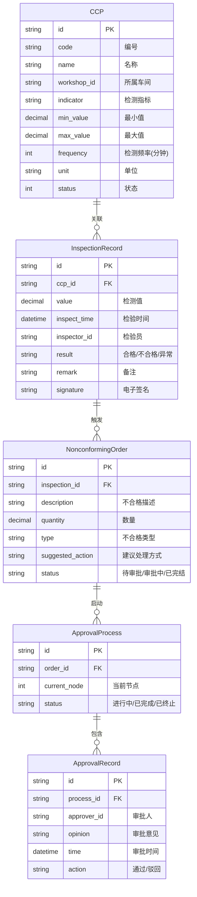

# PRD：食品生产企业 QMS 质量管理系统 - 生产过程质量模块

## 元信息

| 项目 | 内容 |
|------|------|
| 产品名称 | 食品生产企业 QMS 质量管理系统 |
| 产品类型 | B2B 企业级 SaaS |
| PRD 类型 | 新功能（有 UI） |
| 基于框架 | wemirr-platform v3-dev |
| 配套前端 | wemirr-platform-ui |
| 启用 BPM | 是 |
| 模块范围 | 生产过程质量检验模块（第一阶段） |
| 创建时间 | 2025-01-27 |

---

## 1. 业务背景

### 1.1 业务现状

食品生产企业面临以下质量管控挑战：

- **过程监控困难**：生产过程中关键控制点（CCP）缺乏有效监控手段
- **检验效率低下**：过程检验依赖纸质记录，难以追溯和分析
- **异常响应滞后**：发现问题后缺乏快速处理机制
- **数据孤岛严重**：来料、过程、成品检验数据相互独立

### 1.2 业务目标

本模块旨在实现：

- 生产过程关键控制点的实时监控和记录
- 过程检验电子化，支持移动端录入
- 不合格品快速识别和审批处理
- 质量数据实时分析，支持生产决策

### 1.3 用户群体

| 角色 | 描述 | 主要使用场景 |
|------|------|-------------|
| 质量主管 | 负责质量体系管理 | 查看质量看板、审批异常、处理不合格品 |
| 质检员 | 负责现场检验工作 | 录入检验记录、监控关键控制点 |
| 班组长 | 负责生产班组管理 | 查看本班组质量数据、配合处理异常 |
| 生产主管 | 负责生产运营 | 查看生产质量数据、协调处理异常 |

---

## 2. 业务现状与变更

### 2.1 现有流程（无系统支持）

```
生产车间现场
    │
    ▼
质检员人工巡检（纸质记录表）
    │
    ▼
发现异常 → 报告班组长 → 报告质量主管 → 人工评估处理方式
    │
    ▼
处理结果记录（纸质）
```

### 2.2 变更内容

| 变更项 | 现状（变更前） | 目标（变更后） | 影响范围 |
|--------|---------------|---------------|---------|
| 关键控制点监控 | 人工巡检记录 | 系统实时采集、电子化记录 | 所有生产车间 |
| 过程检验录入 | 纸质记录表 | 移动端/PC端电子录入 | 质检员 |
| 异常处理 | 线下审批 | BPM 工作流审批 | 质量主管、生产主管 |
| 数据查询 | 纸质档案查询 | 系统实时查询、报表导出 | 所有用户 |

### 2.3 影响范围

- **受影响部门**：质量部、生产部
- **受影响系统模块**：wemirr-platform-iam（新增质量角色权限）
- **需要启用模块**：wp-bpm 审批流插件

---

## 3. 用户故事和使用场景

### 3.1 关键用户故事

| 编号 | 用户故事 | 角色 | 优先级 |
|------|---------|------|--------|
| US-01 | 作为质检员，我希望在移动端快速录入过程检验记录 | 质检员 | P0 |
| US-02 | 作为质检员，我希望实时监控关键控制点数据 | 质检员 | P0 |
| US-03 | 作为班组长，我希望查看本班组的质量数据看板 | 班组长 | P1 |
| US-04 | 作为质量主管，我希望对不合格品发起审批处理 | 质量主管 | P0 |
| US-05 | 作为质量主管，我希望查看质量报表和分析 | 质量主管 | P1 |
| US-06 | 作为生产主管，我希望协同处理质量异常事件 | 生产主管 | P1 |

### 3.2 使用场景

#### 场景 1：关键控制点巡检

```
场景描述：质检员对生产线的关键控制点进行定时巡检

前置条件：
- 用户已登录系统
- 用户具有"过程检验"权限
- 已配置关键控制点信息

主流程：
1. 质检员进入"过程检验"模块
2. 系统显示待检验的关键控制点列表
3. 质检员选择需要检验的工位
4. 录入检验数据（检测值、检验结果、备注）
5. 系统自动判断是否合格
6. 提交检验记录

后置条件：
- 检验记录保存成功
- 异常数据触发预警通知
```

#### 场景 2：不合格品审批

```
场景描述：发现不合格品后，通过 BPM 审批流进行处理

前置条件：
- 用户已登录系统
- 用户具有"不合格品处理"权限
- 检验记录已标记为不合格

主流程：
1. 质检员发现不合格品
2. 质检员创建不合格品处理单
3. 系统自动根据不合格类型生成审批流程
4. 审批人（质量主管）收到通知
5. 审批人审核后选择处理方式：
   - 返工
   - 降级使用
   - 报废
   - 让步接收
6. 审批人填写审批意见
7. 提交审批结果
8. 系统更新处理状态

后置条件：
- 审批结果通知申请人
- 库存系统同步更新（待集成）
```

---

## 4. 功能需求描述

### 4.1 功能模块结构

```
生产过程质量模块
├── 4.1.1 关键控制点管理
│   ├── CCP 配置
│   ├── CCP 监控
│   └── CCP 历史记录
├── 4.1.2 过程检验管理
│   ├── 检验记录录入
│   ├── 检验记录查询
│   └── 检验记录修改（需授权）
├── 4.1.3 不合格品处理
│   ├── 不合格品登记
│   ├── 审批流程
│   └── 处理结果跟踪
├── 4.1.4 质量看板
│   ├── 实时监控大屏
│   ├── 班组质量统计
│   └── 异常趋势分析
└── 4.1.5 质量报表
    ├── 日报/周报/月报
    ├── 合格率统计
    └── 导出功能
```

### 4.2 关键控制点管理

#### 4.2.1 CCP 配置

| 功能 | 描述 |
|------|------|
| CCP 列表 | 显示所有关键控制点，支持按车间筛选 |
| CCP 新增 | 配置控制点名称、所属车间、检测指标、标准值范围、检测频率 |
| CCP 编辑 | 修改控制点配置 |
| CCP 停用/启用 | 控制是否参与监控 |

#### 4.2.2 CCP 监控

| 功能 | 描述 |
|------|------|
| 实时数据 | 显示各控制点的实时检测数据 |
| 状态指示 | 正常（绿色）/ 预警（黄色）/ 异常（红色） |
| 历史趋势 | 查看单个控制点的历史数据曲线 |

### 4.3 过程检验管理

#### 4.3.1 检验记录录入

| 功能 | 描述 |
|------|------|
| 新增检验 | 选择工位、控制点，录入检测值 |
| 自动判定 | 根据标准值范围自动判定合格/不合格 |
| 图片上传 | 支持上传检验现场照片（最多 3 张） |
| 签名确认 | 质检员电子签名 |

#### 4.3.2 检验记录查询

| 功能 | 描述 |
|------|------|
| 条件查询 | 按日期、工位、控制点、检验员、状态筛选 |
| 详情查看 | 查看检验记录完整信息 |
| 记录导出 | 支持导出 Excel/PDF |

### 4.4 不合格品处理

#### 4.4.1 不合格品登记

| 功能 | 描述 |
|------|------|
| 登记不合格品 | 关联检验记录，录入不合格描述、数量 |
| 不合格类型 | 选择：外观缺陷、重量不符、标签错误、其他 |
| 处理建议 | 质检员填写建议处理方式 |

#### 4.4.2 审批流程

| 功能 | 描述 |
|------|------|
| 发起审批 | 根据不合格类型和金额自动选择审批流程 |
| 审批节点 | 质量主管初审 → 生产主管复核（可选）→ 最终审批 |
| 审批操作 | 通过、驳回、补充材料 |
| 审批意见 | 审批人填写意见和依据 |

#### 4.4.3 处理结果跟踪

| 功能 | 描述 |
|------|------|
| 状态追踪 | 显示当前审批节点和状态 |
| 完结记录 | 归档审批通过的处理记录 |
| 统计分析 | 统计不合格类型分布、处理方式分布 |

### 4.5 质量看板

| 功能 | 描述 |
|------|------|
| 实时监控大屏 | 显示关键指标：今日检验数、合格率、异常数 |
| 班组质量排名 | 按班组显示合格率排名 |
| 趋势图表 | 不合格率趋势、异常分布饼图 |

### 4.6 质量报表

| 功能 | 描述 |
|------|------|
| 检验日报 | 每日检验记录汇总 |
| 检验月报 | 月度质量统计分析 |
| 合格率报表 | 按工位、产品、班组维度的合格率统计 |
| 导出功能 | 支持 Excel、PDF 格式导出 |

---

## 5. 业务规则和约束

### 5.1 基础规则

| 规则编号 | 规则描述 |
|---------|----------|
| BR-001 | 检验记录一旦提交不可删除，只能修改备注 |
| BR-002 | 不合格品必须经过审批流程后才能处理 |
| BR-003 | 检验值超出标准范围自动标记为异常 |
| BR-004 | 电子签名与登录用户绑定 |
| BR-005 | 所有检验记录保留原始值，不允许修改 |

### 5.2 权限约束

| 操作 | 权限要求 |
|------|----------|
| 录入检验记录 | `quality:inspection:create` |
| 查看检验记录 | `quality:inspection:view` |
| 修改检验记录 | `quality:inspection:modify` |
| 发起不合格审批 | `quality:nonconforming:create` |
| 审批不合格品 | `quality:nonconforming:approve` |
| 查看质量报表 | `quality:report:view` |
| 配置 CCP | `quality:ccp:config` |

### 5.3 数据约束

| 约束项 | 描述 |
|--------|------|
| 检验记录保留期 | 至少保留 3 年 |
| 图片格式 | 支持 jpg、png，单张不超过 10MB |
| 审批时限 | 异常处理审批时限为 24 小时 |

---

## 6. 数据概念

### 6.1 业务实体

| 实体 | 说明 | 关键属性 |
|------|------|----------|
| 关键控制点（CCP） | 生产过程中的质量关键控制点 | 编号、名称、所属车间、检测指标、标准值、频率、单位 |
| 过程检验记录 | 质检员录入的检验数据 | 关联CCP、检测值、检验时间、检验员、检验结果、备注 |
| 不合格品单 | 不合格品处理申请 | 关联检验记录、不合格描述、数量、类型、建议处理方式 |
| 审批流程实例 | BPM 审批流程 | 关联不合格品单、当前节点、审批人、状态 |
| 审批记录 | 审批操作记录 | 审批人、审批意见、审批时间、审批结果 |

### 6.2 实体关系



---

## 7. 相关能力识别

| 已有能力 | 能力范围 | 与本需求匹配度 | 能力差距 | 建议方向 | 来源 |
|----------|---------|--------------|---------|---------|------|
| 用户管理 | 用户CRUD、认证、授权 | 中 | 需扩展用户属性支持质量相关岗位 | 复用用户基础，新增质量岗位角色 | README.md |
| 角色权限 | RBAC 角色、菜单、按钮权限 | 中 | 需支持质量检验特定权限 | 在现有RBAC基础上增加质量模块权限 | README.md |
| 多租户 | 租户隔离、数据隔离 | 高 | - | 直接复用 | README.md |
| 字典管理 | 通用字典数据 | 高 | - | 新增检验类型、不合格等级等字典 | README.md |
| 组织架构 | 部门、组织架构管理 | 中 | 需支持工厂、车间、班组层级 | 复用部门结构，支持层级配置 | README.md |
| 数据库访问 | Mybatis-Plus 基础CRUD | 高 | - | 复用 | framework/readme.md |
| BPM审批流 | 工作流审批（可选） | 高 | 需确认是否启用 | 用于不合格品处理审批流程 | wemirr-plugin/README.md |

---

## 8. 非功能需求

### 8.1 性能需求

| 指标 | 目标值 | 说明 |
|------|--------|------|
| 页面加载时间 | < 3 秒 | 检验记录列表页面 |
| 检验数据录入响应 | < 1 秒 | 提交检验记录 |
| 并发用户数 | ≥ 100 | 同时在线用户 |
| 数据查询响应 | < 2 秒 | 报表查询 |

### 8.2 安全需求

| 需求项 | 描述 |
|--------|------|
| 数据权限 | 按租户、按部门隔离检验数据 |
| 操作审计 | 记录所有检验数据修改操作 |
| 电子签名 | 签名数据不可篡改 |
| 敏感数据 | 不合格品详情需权限控制 |

### 8.3 兼容性要求

| 类型 | 要求 |
|------|------|
| 浏览器兼容 | Chrome、Firefox、Edge（最新 2 个主版本） |
| 移动端兼容 | 适配手机、平板（响应式布局） |
| 系统集成 | 需与 wemirr-platform-iam 权限系统集成 |

### 8.4 可用性需求

| 需求项 | 描述 |
|--------|------|
| 离线支持 | 移动端支持离线录入，联网后同步 |
| 操作便捷 | 检验录入支持快速录入模式 |

---

## 9. 可量化的成功指标

| 指标 | 目标值 | 数据来源/采集方式 |
|------|--------|-------------------|
| 检验电子化率 | ≥ 95% | 系统检验记录数 / 计划检验数 |
| 审批时效 | ≤ 24 小时 | 审批完成时间 - 发起时间 |
| 异常响应时间 | ≤ 30 分钟 | 异常发生时间 - 首次响应时间 |
| 质检员录入效率 | 提升 50% | 录入一条记录的平均时间 |

---

## 10. 验收标准

### 10.1 关键控制点管理

- [ ] 可新增、编辑、停用关键控制点
- [ ] CCP 配置包含所有必需字段
- [ ] CCP 列表支持按车间筛选
- [ ] CCP 监控页面实时显示状态

### 10.2 过程检验录入

- [ ] 支持新增检验记录，选择 CCP 和录入检测值
- [ ] 系统自动判定合格/不合格
- [ ] 支持上传检验现场照片
- [ ] 提交后显示电子签名

### 10.3 检验记录查询

- [ ] 支持按日期、工位、检验员筛选
- [ ] 检验详情显示完整信息
- [ ] 支持导出 Excel 格式

### 10.4 不合格品处理

- [ ] 可关联检验记录创建不合格品单
- [ ] 根据规则自动选择审批流程
- [ ] 审批人可查看详情并操作
- [ ] 审批完成后更新处理状态

### 10.5 质量看板

- [ ] 实时显示关键质量指标
- [ ] 显示合格率趋势图表
- [ ] 异常数据高亮显示

### 10.6 权限控制

- [ ] 不同角色看到对应菜单
- [ ] 无权限用户无法访问对应功能
- [ ] 审批权限按角色配置

---

## 11. 项目依赖

### 11.1 内部依赖

| 依赖项 | 说明 |
|--------|------|
| wemirr-platform-iam | 复用用户、角色、权限体系 |
| wemirr-platform-framework | 复用数据库、安全等基础能力 |
| wp-bpm 插件 | 提供审批流能力 |

### 11.2 外部依赖

| 依赖项 | 说明 |
|--------|------|
| 数据库（MySQL 8.0） | 数据存储 |
| Redis | 缓存、实时数据 |
| Nacos | 配置中心 |

---

## 12. 后续迭代规划

本 PRD 为第一阶段（生产过程质量模块），后续计划：

| 阶段 | 范围 | 预估工期 |
|------|------|----------|
| 第二阶段 | 来料检验模块（IQC） | 待定 |
| 第三阶段 | 成品检验模块（OQC） | 待定 |
| 第四阶段 | 供应商管理模块 | 待定 |
| 第五阶段 | 质量报表高级分析 | 待定 |

---

## 13. 术语表

| 术语 | 说明 |
|------|------|
| CCP (Critical Control Point) | 关键控制点，生产过程中需要重点监控的环节 |
| IQC | Incoming Quality Control，来料质量检验 |
| OQC | Outgoing Quality Control，出货质量检验 |
| BPM | Business Process Management，业务流程管理 |
| 多租户 | 一个系统支持多个独立客户（租户）使用 |

---

## 附录

### A. 参考资料

- wemirr-platform 开发文档：https://docs.battcn.com
- wemirr-platform 演示地址：https://cloud.battcn.com
- Sa-Token 文档：http://sa-token.dev33.cn/

### B. 相关文档

| 文档 | 链接 |
|------|------|
| 配套前端项目 | https://gitee.com/battcn/wemirr-platform-ui |
| BPM 插件文档 | wemirr-platform-3-dev/wemirr-plugin/wemirr-platform-bpm/readme.md |
